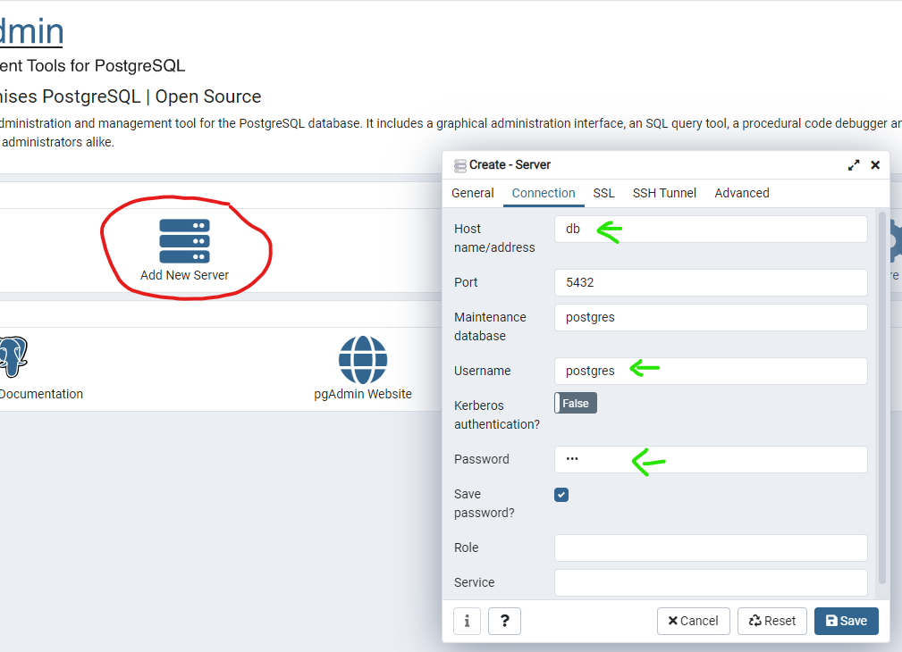
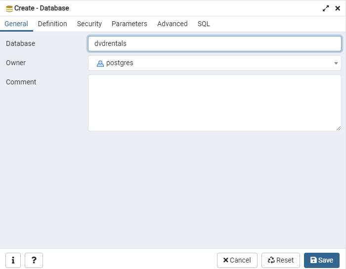
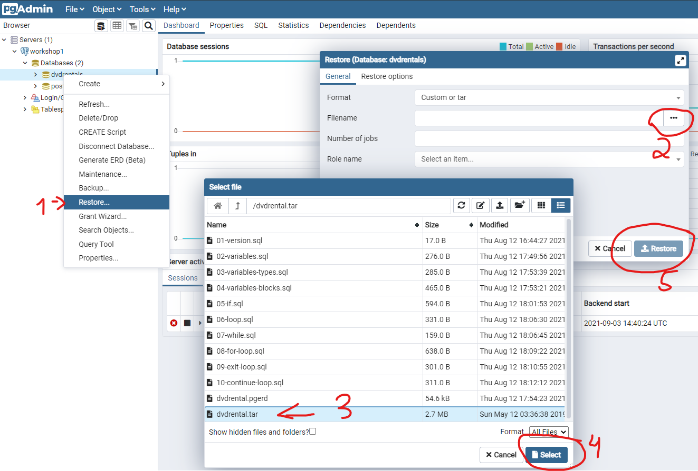

# Workshop PostgREST

Parte do workshop sobre **Stored Procedure no Postgres**

Baixe esse projeto com
```shell script
git clone https://github.com/alexzrp/workshop-postgrest.git
```

## Requisitos
- Docker

## Composição
- Postgres 13.x
- pgAdmin4 v5.6

### Para rodar os ambientes:

```shell script
cd workshop-postgrest
docker compose up -d
```

### Acesse o pgAdmin:

- **URL:** <http://localhost:6002>
- **Usuario:** `cap@zrp.com.br`
- **Senha:** `cap`

### Setup pgAdmin4

Clique em CREATE SERVER, preencha o nome `workshop1`.
Em `Connection` preencha como a imagem abaixo usando a senha `cap`
Marque a opção `Save password?` para manter a senha salva no seu pgadmin4



### Setup PostgreSQL

No lado esquerdo, clique com o botão direito em `Databases -> Create -> Server`



#### Restaurando o banco DVDRENTALS

Agora que já temos o banco de dados, vamos restaurar todos os objetos de um dump.

Siga os passos da figura abaixo:



Agora você está pronto para iniciar.

Bom workshop!
